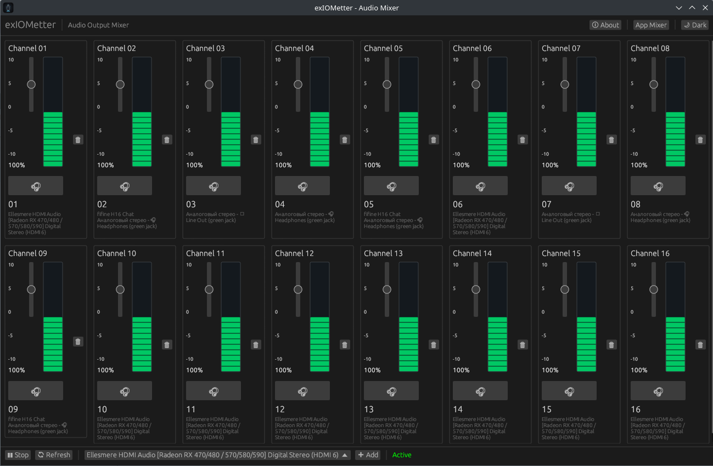

<p align="center">
  <h1>exIOMetter</h1>
</p>

<p align="center">
  
</p>

<p align="center">
  <strong>Lightweight audio output mixer for Linux with PulseAudio/PipeWire support</strong>
</p>

## Screenshot

<p align="center">
  
</p>

## Overview

exIOMetter is a graphical application that allows simultaneous audio playback to multiple output devices. It provides individual volume control and muting for each connected audio device with real-time visual level monitoring.

## Features

- Combine multiple audio outputs for simultaneous playback
- Individual volume control per device (0-200%)
- Per-device mute functionality
- Application mixer for per-app volume control
- Dark and light theme support
- PulseAudio and PipeWire compatible
- Add/remove devices on the fly

## System Requirements

- Linux operating system
- PulseAudio or PipeWire audio server
- Rust 1.70 or newer (for building from source)

### Build Dependencies

Debian/Ubuntu:
```bash
sudo apt install libpulse-dev libasound2-dev pkg-config
```

Fedora:
```bash
sudo dnf install pulseaudio-libs-devel alsa-lib-devel
```

Arch Linux:
```bash
sudo pacman -S libpulse alsa-lib
```

## Installation

### From Source

1. Clone the repository:
```bash
git clone https://github.com/Nicetink/exiometter.git
cd exiometter
```

2. Build the application:
```bash
cargo build --release
```

3. The binary will be located at:
```bash
target/release/exiometter
```

### From repo
```bash
curl -fsSL https://repokai.remotewire.net/public.key | sudo gpg --dearmor -o /usr/share/keyrings/exiometter-keyring.gpg

echo "deb [signed-by=/usr/share/keyrings/exiometter-keyring.gpg] https://repokai.remotewire.net/ noble main" | sudo tee /etc/apt/sources.list.d/exiometter.list

sudo apt update

sudo apt install exiometter
```
## Usage

1. Launch the application
2. Select an audio output device from the dropdown menu
3. Click "Add" to add the device to the mixer
4. Repeat for all desired output devices
5. Click "Start" to begin routing audio to all selected devices
6. Adjust individual volume sliders and mute buttons as needed
7. Click "Stop" to stop the mixer

### Application Mixer

Click "App Mixer" to control volume levels for individual applications currently playing audio.

### Interface

- Volume sliders: Adjust from 0% (silent) to 200% (amplified)
- Mute buttons: Instantly silence individual devices
- VU meters: Real-time audio level visualization
- Theme toggle: Switch between dark and light modes

## Technical Details

### Architecture

- **audio_engine.rs** - Core audio processing using PulseAudio bindings
- **ui.rs** - User interface built with egui
- **main.rs** - Application entry point and window initialization

### Technology Stack

- Rust programming language
- egui/eframe for GUI
- libpulse-binding for PulseAudio/PipeWire integration
- image for icon handling

### How It Works

exIOMetter uses PulseAudio's module-combine-sink to create a virtual audio device that duplicates audio streams to multiple physical outputs. Each output maintains independent volume control and mute state through the PulseAudio API.

## License

Nicet Studio PUBLIC LICENSE Version 2, June 2026

Copyright (C) 2026 KAInaps

Permission is hereby granted, free of charge, to any person obtaining a copy of this software and associated documentation files (the "Software"), to use, study, copy, modify, merge, and distribute the Software, subject to the conditions specified in the LICENSE file.

## Author

KAInaps

## Contributing

Contributions are welcome. Please ensure all changes maintain compatibility with both PulseAudio and PipeWire.

